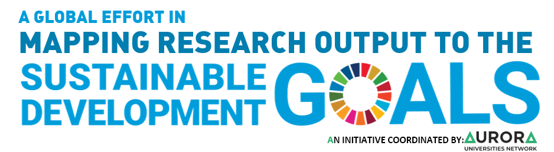
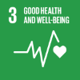
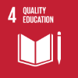
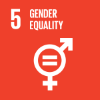
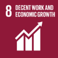

# Search Queries for "Mapping Research Output to the Sustainable Development Goals (SDGs)"
__This package contains machine readable (xml) search queries, for the Scopus publications database, to find domain specific research output that are related to the 17 Sustainable Development Goals (SDGs).__

___[Click here for HUMAN READABLE version](https://aurora-network-global.github.io/sdg-queries/)___ | 
___[Click here for PROJECT WEBSITE](https://aurora-network.global/project/sdg-analysis-bibliometrics-relevance/)___

[Sustainable Development Goals](https://sustainabledevelopment.un.org/sdgs) are the 17 global challenges set by the United Nations. Within each of the goals specific targets and indicators are mentioned to monitor the progress of reaching those goals by 2030. In an effort to capture how research is contributing to move the needle on those challenges, we earlier have made an initial classification model than enables to quickly identify what research output is related to what SDG. (This [Aurora SDG dashboard](https://aurora-network.global/project/sdg-analysis-bibliometrics-relevance/) is the  initial outcome as _proof of practice_.)  

The initiative started from the Aurora Universities Network in 2017, in the working group "[Societal Impact and Relevance of Research](https://aurora-network.global/activity/societal-impact-and-relevance-of-research-sirr/)", to investigate and to make visible 1. what research is done that are relevant to topics or challenges that live in society (for the proof of practice this has been scoped down to the SDGs), and 2. what the effect or impact is of implementing those research outcomes to those societal challenges (this also have been scoped down to research output being cited in policy documents from national and local governments an NGO's).

The classification model we have used are 17 different search queries on the Scopus database. The search queries are elegant constructions with keyword combinations and boolean operators, in the syntax specific to the Scopus Query Language. We have used Scopus because it covers more research area's that are relevant to the SDG's, and we could filter much easier the Aurora Institutions.

## SDG Search queries
Select one of the SDG icons to go to the latest Search Query.

[{:height="100px" width="100px"}](query_SDG1.xml) | [{:height="100px" width="100px"}](query_SDG2.xml) | [{:height="100px" width="100px"}](query_SDG3.xml) | [{:height="100px" width="100px"}](query_SDG4.xml) | [{:height="100px" width="100px"}](query_SDG5.xml) | [{:height="100px" width="100px"}](query_SDG6.xml)
--- | --- | --- | --- | --- | ---
[{:height="100px" width="100px"}](query_SDG7.xml) | [{:height="100px" width="100px"}](query_SDG8.xml) | [{:height="100px" width="100px"}](query_SDG9.xml) | [{:height="100px" width="100px"}](query_SDG10.xml) | [{:height="100px" width="100px"}](query_SDG11.xml) | [{:height="100px" width="100px"}](query_SDG12.xml)
[{:height="100px" width="100px"}](query_SDG13.xml) | [{:height="100px" width="100px"}](query_SDG14.xml) | [{:height="100px" width="100px"}](query_SDG15.xml) | [{:height="100px" width="100px"}](query_SDG16.xml) | [{:height="100px" width="100px"}](query_SDG17.xml) |  

## Versions
Different versions of the search queries have been made over the past years to improve the precision (soundness) and recall (completeness) of the results. The queries have been made in a team effort by several bibliometric experts from the Aurora Universities. Each one did two or 3  SDG's, and than reviewed each other's work.

version | date | changes | download
--- | --- | --- | ---
1.0 | January 2018 | _Initial 'strict' version._ In this version only the terms were used that appear in the SDG policy text of the targets and indicators defined by the UN. At this point we have been aware of the [SDSN Compiled list of keywords](https://ap-unsdsn.org/webinar-mapping-university-contributions-to-the-sdgs/), and used them as inspiration. Rule of thumb was to use _keyword-combination searches_ as much as possible rather than _single-keyword searches_, to be more precise rather than to yield large amounts of false positive papers. Also we did not use the inverse or 'NOT' operator, to prevent removing true positives from the result set.  This version has not been reviewed by peers. | [GitHub](https://github.com/Aurora-Network-Global/sdg-queries/releases/tag/v1.0) / [Zenodo](https://doi.org/10.5281/zenodo.3817352)
2.0 | March 2018 | _Reviewed 'strict' version._ Same as version 1, but now reviewed by peers | [GitHub](https://github.com/Aurora-Network-Global/sdg-queries/releases/tag/v2.0) / [Zenodo](https://doi.org/10.5281/zenodo.3817433)
3.0 | May 2019 | _'echo chamber' version._ We noticed that using strictly the terms that policy makers of the UN use in the targets and indicators, that much of the research that did not use that specific terms was left out in the result set. (eg. "mortality" vs "deaths") To increase the recall, without reducing precision of the papers in the  results, we added keywords that were obvious synonyms and antonyms to the existing 'strict' keywords. This was done based on the keywords that appeared in papers in the result set of version 2. This creates an 'echo chamber', that results in more of the same papers.| [GitHub](https://github.com/Aurora-Network-Global/sdg-queries/releases/tag/v3.0) / [Zenodo](https://doi.org/10.5281/zenodo.3817437)
4.0 | August 2019 | _uniform 'split' version._ Over the course of the years, the UN changed and added Targets and indicators. In order to keep track of if we missed a target, we have split the queries to match the targets within the goals. This gives much more control in maintenance of the queries. Also in this version the use of brackets, quotation marks, etc. has been made uniform, so it also works with API's, and not only with GUI's. His version has been used to evaluate using a survey, to get baseline measurements for the precision and recall. Published here: [Survey data of "Mapping Research output to the SDGs" by Aurora Universities Network (AUR) doi:10.5281/zenodo.3798385](https://doi.org/10.5281/zenodo.3798385) | [GitHub](https://github.com/Aurora-Network-Global/sdg-queries/releases/tag/v4.0) / [Zenodo](https://doi.org/10.5281/zenodo.3817443)
5.0 | June 2020 | 'improved' version. In order to better reflect academic representation of research output that relate to the SDG's, we have added more keyword combinations to the queries to increase the recall, to yield more research papers related to the SDG's, using academic terminology. We mainly used the input from the [Vanderfeesten, Maurice, Spielberg, Eike, & Gunes, Yassin. (2020) _Survey data of "Mapping Research output to the SDGs" by Aurora Universities Network (AUR)_](https://doi.org/10.5281/zenodo.3798385). We ran several text analyses: Frequent term combination in title and abstracts from Suggested papers, and in selected (accepted) papers, suggested journals, etc. Secondly we got inspiration out of the Elsevier SDG queries [ Jayabalasingham, Bamini; Boverhof, Roy; Agnew, Kevin; Klein, Lisette (2019), _“Identifying research supporting the United Nations Sustainable Development Goals”_, Mendeley Data, v1](https://dx.doi.org/10.17632/87txkw7khs.1). And thirdly we got inspiration from this controlled vocabulary containing closely related terms. [Duran-Silva, Nicolau, Fuster, Enric, Massucci, Francesco Alessandro, & Quinquillà, Arnau. (2019). _A controlled vocabulary defining the semantic perimeter of Sustainable Development Goals_ (Version 1.2) [Data set]. Zenodo.](http://doi.org/10.5281/zenodo.3567769)   | [GitHub](https://github.com/Aurora-Network-Global/sdg-queries/releases/tag/v5.0) / [Zenodo](https://doi.org/10.5281/zenodo.3817445)

## Contribute and improve the SDG Search Queries
We welcome you to join the Github community and to fork, branch, improve and make a pull request to add your improvements to the new version of the SDG queries.
__https://github.com/Aurora-Network-Global/sdg-queries__

## Queries in XML - Human editable, Machine readable, Version controllable
We do have made all the queries in XML format from version 4 onward, but also referred it back to version 1. This enables:
*  to make it human editable and machine readable at the same time. Putting a human description of what you want to search and the actual search syntax next to each other is common practice in systematic reviews. It also enables to automate and process queries in chunks, since the number of characters used in an API request can be limited, or to review the results of each chunk.
* to make it human readable in HTML. We have added a XSL (xml style sheet), open the XML file in a browser, and you just see a neatly formatted table. For your convenience, below the table, we have concatenated all query parts, you can copy-paste it to the search interface.
* translate to other query languages. As you can translate the XML to HTML, you can also translate the Scopus syntax to be used in an other query language, eg. Web of Science, Lucene, CQL, etc.
* it is much easier to work with version control in a Git repository tracking all the changes. It also enables others to fork, branch and sent pull-requests (improvements) to be adopted in the main branch (trunk) for release into an new version.

Translation to HTML (XSL) and a descriptive schema (XSD) are available in this package.

## Validation results of SDG queries v4.0 - Precision and Recall
In order to validate classification model version 4 (on soundness/precision and completeness/recall), and receive input for improvement, a survey has been conducted to capture expert knowledge from senior researchers in their research domain related to the SDG. The survey was open to the world, but mainly distributed to researchers from the [Aurora Universities Network](https://aurora-network.global/). The survey was open from October 2019 till January 2020, and captured data from 244 respondents in Europe and North America.

The data can be found here:
 [Survey data of "Mapping Research output to the SDGs" by Aurora Universities Network (AUR) doi:10.5281/zenodo.3798385](https://doi.org/10.5281/zenodo.3798385)

We used the data for creating a baseline for the SDG classification model, and secondly to gather information on improving a next version.

The graph below shows the precision (soundness) on the vertical axis, and the recall (completeness) on the horizontal axis of each SDG query in the version 4 set. The size is the number of papers reviewed by respondents (accepted + rejected).  The rough averages (including outliers) of all SDG queries on Precision is 0.61, and on Recall is 0.15. Meaning we mostly find the right papers, but there are much more relevant papers we do not capture with the version 4 classification model. This was expected, therefore this sets the baseline for a version 5 of the classification model.

## License and Attribution, Acknowledgements and how to Cite
### Acknowledgements
We would like to thank the presidents of the Aurora Universities for their support and executive representation in this project. Also we would like to thank all researchers involved to have shared their expertise.
Many people from within the Aurora University Network were involved making these query improvements possible.

If you want to tribute this hard work, please reuse these  SDG queries to create or improve your services and share your outcomes.

Do so by respecting the license and attribute the contributors.

### Please cite these search queries sets as follows:  
*Search Queries for "Mapping Research Output to the Sustainable Development Goals (SDGs)" v1.0* by Aurora Universities Network (AUR) [doi:10.5281/zenodo.3817352](https://doi.org/10.5281/zenodo.3817352)

*Search Queries for "Mapping Research Output to the Sustainable Development Goals (SDGs)" v2.0* by Aurora Universities Network (AUR) [doi:10.5281/zenodo.3817433](https://doi.org/10.5281/zenodo.3817433)

*Search Queries for "Mapping Research Output to the Sustainable Development Goals (SDGs)" v3.0* by Aurora Universities Network (AUR) [doi:10.5281/zenodo.3817437](https://doi.org/10.5281/zenodo.3817437)

*Search Queries for "Mapping Research Output to the Sustainable Development Goals (SDGs)" v4.0* by Aurora Universities Network (AUR) [doi:10.5281/zenodo.3817443](https://doi.org/10.5281/zenodo.3817443)

*Search Queries for "Mapping Research Output to the Sustainable Development Goals (SDGs)" v5.0* by Aurora Universities Network (AUR) [doi:10.5281/zenodo.3817445](https://doi.org/10.5281/zenodo.3817445)

### License for reuse:
[Creative Commons Attribution 4.0 International License](https://creativecommons.org/licenses/by/4.0/legalcode)

### License Attribution when reusing this data:
Note: different people contributed to different versions.

* Search Queries for "Mapping Research Output to the Sustainable Development Goals (SDGs)" v1.0 by Aurora Universities Network (AUR); Didier Vercueil (UGA); Nykohla Strong (UAB); Felix Schmidt (UDE); Adam Green (UEA); Jaqui Farrar (UEA); Lars Kullman (UGO); René Otten (VUA); Maurice Vanderfeesten (VUA); is licensed under a Creative Commons Attribution 4.0 International License.
https://doi.org/10.5281/zenodo.3817352
Based on a work at https://sustainabledevelopment.un.org/sdgs

* Search Queries for "Mapping Research Output to the Sustainable Development Goals (SDGs)" v2.0 by Aurora Universities Network (AUR); Didier Vercueil (UGA); Nykohla Strong (UAB); Raf Guns (UAN); Susanne Mikki (UBE); Felix Schmidt (UDE); Jaqui Farrar (UEA); Lars Kullman (UGO); Baldvin Zarioh (UIC); René Otten (VUA); Maurice Vanderfeesten (VUA); is licensed under a Creative Commons Attribution 4.0 International License.
https://doi.org/10.5281/zenodo.3817433
Based on a work at https://doi.org/10.5281/zenodo.3817352

* Search Queries for "Mapping Research Output to the Sustainable Development Goals (SDGs)" v3.0 by Aurora Universities Network (AUR); Didier Vercueil (UGA); Nykohla Strong (UAB); Raf Guns (UAN); Felix Schmidt (UDE); Ane Sesma (UEA); Lars Kullman (UGO); Baldvin Zarioh (UIC); René Otten (VUA); Maurice Vanderfeesten (VUA); is licensed under a Creative Commons Attribution 4.0 International License.
https://doi.org/10.5281/zenodo.3817437
Based on a work at https://doi.org/10.5281/zenodo.3817433

* Search Queries for "Mapping Research Output to the Sustainable Development Goals (SDGs)" v4.0 by Aurora Universities Network (AUR); Didier Vercueil (UGA); Nykohla Strong (UAB); Raf Guns (UAN); Eike Spielberg (UDE); Felix Schmidt (UDE); Linda Hasse (UDE); Lars Kullman (UGO); Baldvin Zarioh (UIC); René Otten (VUA); Maurice Vanderfeesten (VUA); is licensed under a Creative Commons Attribution 4.0 International License.
https://doi.org/10.5281/zenodo.3817443
Based on a work at https://doi.org/10.5281/zenodo.3817437

* Search Queries for "Mapping Research Output to the Sustainable Development Goals (SDGs)" v5.0 by Aurora Universities Network (AUR); Alessandro Arienzo (UNA); Roberto delle Donne (UNA); Ignasi Salvadó Estivill (URV); José Luis González Ugarte (URV); Didier Vercueil (UGA); Nykohla Strong (UAB); Eike Spielberg (UDE); Felix Schmidt (UDE); Linda Hasse (UDE); Ane Sesma (UEA); Baldvin Zarioh (UIC); Friedrich Gaigg  (UIN); René Otten (VUA); Nicolien van der Grijp (VUA); Yasin Gunes (VUA); Maurice Vanderfeesten (VUA); is licensed under a Creative Commons Attribution 4.0 International License.
https://doi.org/10.5281/zenodo.3817445
Based on a work at https://doi.org/10.5281/zenodo.3817443

## Contributors, full list
Below you'll see the full list of contributors to this project. With out them this was not possible.

Full name | Organisation Name | Org Abr | ORCiD | Project role | SDG query v1 | SDG query v2 | SDG query v3 | SDG query v4 | SDG query v5
--- | --- | --- | --- | --- | --- | --- | --- | --- | ---
Vanderfeesten, Maurice | Vrije Universiteit Amsterdam | VUA | 0000-0002-5119-3514 | Project leader | x | x | x | x | x
Spielberg, Eike | University of Duisburg-Essen | UDE | 0000-0002-3333-5814 | Workpackage leader | x | x | x | x | x
Otten, René | Vrije Universiteit Amsterdam | VUA | 0000-0002-6485-8810 | Project member | x | x | x | x | x
Strong, Nykohla | University of Aberdeen | UAB | 0000-0002-6137-591X | Project member | x | x | x | x | x
Schmidt, Felix | University of Duisburg-Essen | UDE |  | Project member | x | x | x | x | x
Zarioh, Baldvin | University of Iceland | UIC | 0000-0001-9317-2597 | Project member |  | x | x | x | x
Vercueil, Didier | Université Grenoble-Alpes | UGA |  | Project member | x | x | x | x | x
Guns, Raf | University of Antwerp | UAN | 0000-0003-3129-0330 | Project member |  | x | x | x |
Arienzo, Alessandro | Università degli Studi di Napoli Federico II | UNA | 0000-0002-2867-5363 | Project member |  |  |  |  | x
Delle Donne, Roberto | Università degli Studi di Napoli Federico II | UNA | 0000-0001-8331-9436 | Project member |  |  |  |  | x
Salvadó Estivill, Ignasi | Universitat Rovira i Virgili | URV |  | Project member |  |  |  |  | x
González Ugarte, José Luis | Universitat Rovira i Virgili | URV |  | Project member |  |  |  |  | x
Mikki, Susanne | University of Bergen | UBE | 0000-0001-7078-7126 | Project member |  | x |  |  |
Hasse, Linda | University of Duisburg-Essen | UDE |  | Project member |  |  |  | x | x
Green, Adam | University of East Angia | UEA | 0000-0002-7397-6579 | Project member | x |  |  |  |
Sesma, Ane | University of East Angia | UEA | 0000-0003-3982-8932 | Project member |  |  | x |  | x
Farrar, Jaqui | University of East Angia | UEA |  | Project member | x | x |  |  |
Kullman, Lars | University of Gothenburg | UGO | 0000-0002-8871-7887 | Project member | x | x | x | x |
Gaigg, Friedrich | University of Innsbruck | UIN |  | Project member |  |  |  |  | x
Grijp, Nicolien van der | Vrije Universiteit Amsterdam | VUA | 0000-0002-5119-3514 | Project member |  |  |  |  | x
Gunes, Yasin | Vrije Universiteit Amsterdam | VUA |  | Project member |  |  |  |  | x
Besselaar, Peter van den  |  Vrije Universiteit Amsterdam | VUA | 0000-0002-8304-8565 | Supervisor |  |  | x | x | x
Both, Joeri  | Vrije Universiteit Amsterdam | VUA |  | Supervisor |  | x | x | x | x
Kouwenaar, Kees | AURORA University Network | AUR |  | Sponsor | x | x | x | x | x
Beukering, Pieter van | Vrije Universiteit Amsterdam | VUA | 0000-0001-7146-4409 | Sponsor | x | x | x | x |

## Related works
works | related
--- | ---
http://ap-unsdsn.org/webinar-mapping-university-contributions-to-the-sdgs/ | A compiled list of keyword used by the Sustainable Development Solutions Network in the pacific to mapping university contributions to the Sustainable Development Goals (SDGs)
[Vanderfeesten, Maurice, Spielberg, Eike, & Gunes, Yassin. (2020) _Survey data of "Mapping Research output to the SDGs" by Aurora Universities Network (AUR)_](https://doi.org/10.5281/zenodo.3798385). | This contains publications hand picked by researchers that relate to an SDG. We ran several text analyses: Frequent term combination in title and abstracts from Suggested papers, and in selected (accepted) papers, suggested journals, etc.
[Jayabalasingham, Bamini; Boverhof, Roy; Agnew, Kevin; Klein, Lisette (2019), _"Identifying research supporting the United Nations Sustainable Development Goals"_, Mendeley Data, v1](https://dx.doi.org/10.17632/87txkw7khs.1).| These Elsevier SDG queries are used in the Times Higher Education Impact Ranking. This has more recall but is less precise.
[Duran-Silva, Nicolau, Fuster, Enric, Massucci, Francesco Alessandro, & Quinquillà, Arnau. (2019). _A controlled vocabulary defining the semantic perimeter of Sustainable Development Goals_ (Version 1.2). Zenodo.](http://doi.org/10.5281/zenodo.3567769)  | A controlled vocabulary containing closely related terms, based on word vectors.
